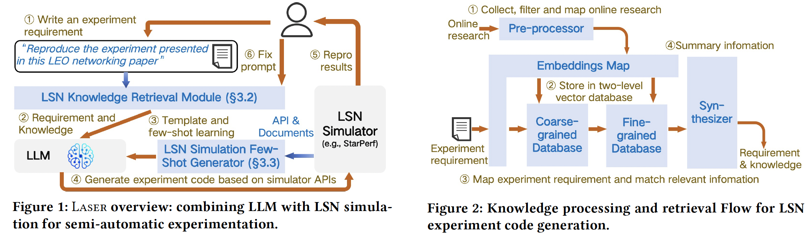

# Laser

This repository implements Laser, a Large Language Model (LLM)-assisted semi-automated tool designed for reproducing experiments in Low Earth Orbit (LEO) Satellite Networks (LSN). It leverages advanced natural language understanding capabilities of LLMs to interpret research papers and generate executable code, significantly reducing the manual effort required for re-implementing experiments from scratch. More details can be found in the LEO-NET 2025 paper: *How LLM Saved Me from Struggling with Experiment Reproduction: LEO Networking as A Case Study.*

## Prerequisites

Laser is run in python 3 and the following libraries should be installed:

- faiss-cpu~=1.11.0.post1
- torch~=2.7.1
- numpy~=2.1.2
- transformers~=4.53.2
- sentence-transformers~=5.0.0
- safetensors~=0.5.3
- huggingface-hub~=0.33.4

## Usage & Workflow

The Workflow of Laser is shown in the following figure: 

(1) In Figure 1:

**Figure 1 ①**: Users write an experiment requirement file based on their own experimental needs, such as "*Reproduce the experiment presented in this LEO networking paper.*"

(2) Then proceed to the process shown in Figure 2: 

**Figure 2 ①**: Laser collects, filters and maps online research (`preprocessor.py`)

**Figure 2 ②**: Laser stores the embeddings map and experiment requirements in a two-level vector database (`L1_database.py` for Coarse-grained database, `L2_database.py` for Fine-grained database)

**Figure 2 ③**: Laser maps experiment requirement and match relevant information(`search.py` in `coarse_index.faiss` and `fine_index.faiss`)

**Figure 2 ④**: Laser summaries information and generates requirements and knowledge.

(3) Then back to Figure 1: 

Laser relies on an underlying LSN simulator (e.g., [StarPerf](https://github.com/SpaceNetLab/StarPerf_Simulator)), which provides APIs and documents. Based on these APIs and documentation, Laser generates a standardized manual (`Manual.pdf`). This manual serves as a template for code generation, and Laser performs few-shot learning using the manual as guidance.

**Figure 1 ② and Figure 1 ③**: The requirements and knowledge obtained in Figure 2 ③, along with the template, are fed into an LLM (e.g., GPT-4o) to generate the corresponding code.

**Figure 1 ④ and Figure 1 ⑤**: The LLM generates experiment code based on the simulator APIs. The user then manually pastes the generated code into the simulator and runs it. The simulator provides feedback on the results to the user.

**Figure 1 ⑥**: If the user finds any errors in the code, they can provide a fix prompt to Laser. Laser will then continue the execution and adjust the code accordingly to generate the corrected version.

